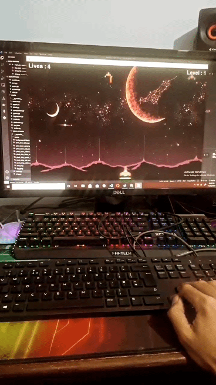

# Space Shooter Game

This is created to try out pygame. If you find helpful, that's great, mission accomplished.

### Installation

Installation is fairy easy if you know the norms of python. We've run this in python3.6, if you face issue because of
version you are on your own. Following is one by one step to have it installed.

1. Pull the repo

    ```shell
    git clone git@github.com:Samul333/space-wars.git
    cd space-wars
    ```

2. Create virtualenv if you haven't created already, if you need help try googling.
3. Activate your virtual env
4. Install requirements

    ```shell
    pip install -r requirements.txt
    ```

5. Run

    ```shell
    cd game
    python main.py
    ```

### Running next time

This assumes you wanted to run again given you've already finished installation

1. Activate your virtual env
2. Go to game dir `cd game`
3. Start Game `python main.py`

### Space Shooter in Action


